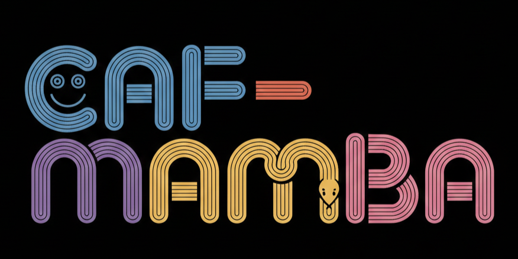
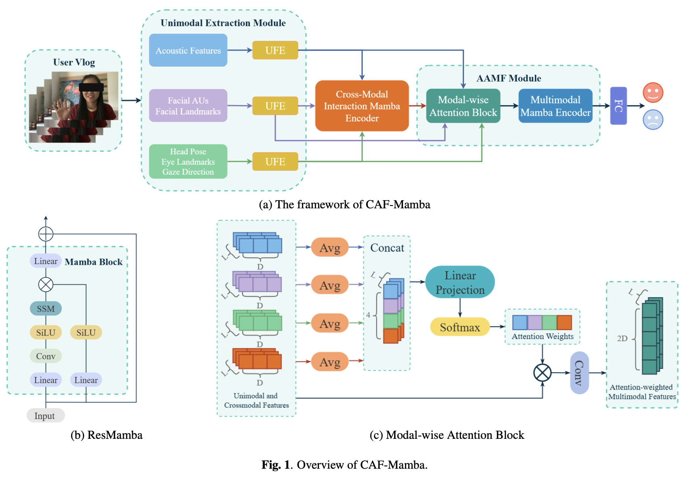

<div align=center>

</div>
<h1 align="center"> CAF-Mamba </h1>

**[ICASSP 2026] CAF-Mamba: Mamba-Based Cross-Modal Adaptive Attention Fusion for Multimodal Depression Detection**

## 📣 News
- `Jan. 18th, 2026`: CAF-Mamba has been accepted by [IEEE ICASSP 2026 Conference](https://2026.ieeeicassp.org/)🎉
- `Jan. 29th, 2026`: The final version of our paper is available on [arXiv](https://arxiv.org/abs/2601.21648), and the source code has been released.
## 📖 Abstract
Depression is a prevalent mental health disorder that severely impairs daily functioning and quality of life. While recent deep learning approaches for depression detection have shown promise, most rely on limited feature types, overlook explicit cross-modal interactions, and employ simple concatenation or static weighting for fusion. To overcome these limitations, we propose CAF-Mamba, a novel Mamba-based cross-modal adaptive attention fusion framework. CAF-Mamba not only captures cross-modal interactions explicitly and implicitly, but also dynamically adjusts modality contributions through a modality-wise attention mechanism, enabling more effective multimodal fusion. Experiments on two in-the-wild benchmark datasets, LMVD and D-Vlog, demonstrate that CAF-Mamba consistently outperforms existing methods and achieves state-of-the-art performance. 



---
## ⚙️ Environment Setup

### 1. Clone Repository
```python
git clone https://github.com/zbw-zhou/CAF-Mamba.git
```
### 2. Requirements

Our implementation is based on Python 3.10 and CUDA 11.8. Please adjust the environment configuration if necessary to match your own environment.
The major dependencies, including PyTorch and Mamba, are listed below:

```python
conda create -n myenv python=3.10
conda activate myenv
pip install torch==2.1.1 torchvision==0.16.1 torchaudio==2.1.1 --index-url https://download.pytorch.org/whl/cu118
pip install numpy==1.26.2 speechbrain==1.0.2 transformers==4.35.2
```
Install the required Mamba-related packages:
```python
wget https://github.com/Dao-AILab/causal-conv1d/releases/download/v1.2.0.post1/causal_conv1d-1.2.0.post1+cu118torch1.12cxx11abiFALSE-cp310-cp310-linux_x86_64.whl
pip install causal_conv1d-1.2.0.post1+cu118torch1.12cxx11abiFALSE-cp310-cp310-linux_x86_64.whl
pip install mamba-ssm==1.2.0.post1
```

---
## 📚 Datasets

### 1. Download
We conduct experiments on two publicly available multimodal depression detection datasets:
- Large-Scale Multimodal Vlog Dataset (LMVD)\
 [https://github.com/helang818/LMVD?tab=readme-ov-file](https://github.com/helang818/LMVD?tab=readme-ov-file)
- Depression Vlog Dataset (D-Vlog)\
 [https://sites.google.com/view/jeewoo-yoon/dataset](https://sites.google.com/view/jeewoo-yoon/dataset)

### 2. References

```
He, L., Chen, K., Zhao, J., Wang, Y., Pei, E., Chen, H., Jiang, J., Zhang, S., Zhang, J., Wang, Z., He, T., Tiwari, P. (2026). LMVD : A large-scale multimodal vlog dataset for depression detection in the wild.
Information Fusion, 126(Part: B). https://doi.org/10.1016/j.inffus.2025.103632
```
```
Yoon, J., Kang, C., Kim, S., & Han, J. (2022). D-vlog: Multimodal Vlog Dataset for Depression Detection.
Proceedings of the AAAI Conference on Artificial Intelligence, 36(11), 12226-12234. https://doi.org/10.1609/aaai.v36i11.21483
```
We sincerely appreciate the authors for their valuable contributions and for making these datasets publicly available.

---
## 🚀 Training and Evaluation

The CAF-Mamba can be trained and evaluated on both LMVD and D-VLOG datasets.\
- To process the multimodal features of the LMVD dataset\
  (please refer to the paper Section 3.2.1):
```python
$ python main.py --train --if_wandb --epochs 80 --batch_size 16 --learning_rate 1e-4 --model CafMamba --dataset lmvd --gpu 0 --scheduler
```
- To process the bimodal features (acoustic features and facial landmarks) of both DVLOG and LMVD datasets\
  (please refer to the paper Section 3.2.2):
```python
$ python main.py --train --if_wandb --epochs 80 --batch_size 16 --learning_rate 1e-4 --model CafMambaBimodal --dataset lmvd --gpu 0 --scheduler
$ python main.py --train --if_wandb --epochs 80 --batch_size 16 --learning_rate 1e-4 --model CafMambaBimodal --dataset dvlog --gpu 0 --scheduler
```

---
## 🖊️ Citation

If you find this work useful in your research, please consider citing our paper:
```bibtex
@misc{zhou2026cafmambamambabasedcrossmodaladaptive,
      title={CAF-Mamba: Mamba-Based Cross-Modal Adaptive Attention Fusion for Multimodal Depression Detection}, 
      author={Bowen Zhou and Marc-André Fiedler and Ayoub Al-Hamadi},
      year={2026},
      eprint={2601.21648},
      archivePrefix={arXiv},
      primaryClass={cs.CV},
      url={https://arxiv.org/abs/2601.21648}, 
}
```

---
## 🤝 Acknowledgement
This work builds upon several excellent open-source projects and prior research efforts.
- We gratefully acknowledge the wonderful work of [Mamba](https://github.com/state-spaces/mamba).
- We acknowledge the excellent work of [LMVD](https://arxiv.org/abs/2407.00024), [D-Vlog](https://ojs.aaai.org/index.php/AAAI/article/view/21483) and [DepMamba](https://ieeexplore.ieee.org/document/10889975).


